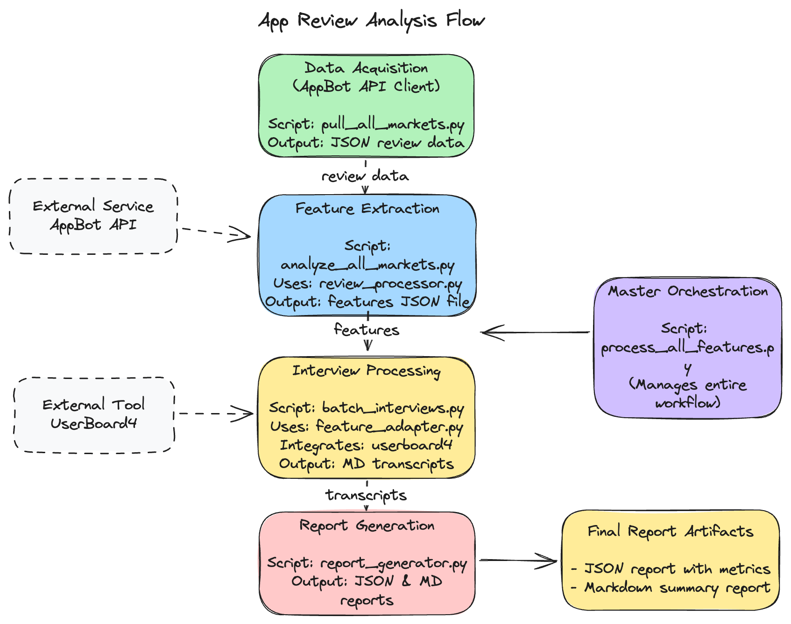

# App Review Analysis System

A comprehensive platform for collecting, analyzing, and validating app review feedback using AI-powered natural language processing and interactive user interviews.



## Overview

This system automates the process of transforming app store reviews into actionable product insights through a series of integrated components:

1. **Data Acquisition** - Collects app reviews from all markets via the AppBot API
2. **Feature Extraction** - Uses GPT-4o to identify feature requests in reviews
3. **Interview Processing** - Validates feature ideas through simulated user interviews
4. **Report Generation** - Creates comprehensive reports with actionable insights

## Key Components

### 1. Reviews Fetcher

The core data collection and processing pipeline for app reviews:

- **AppBot API Client** (`appbot-client/`) - Python client for AppBot API
- **App Review Analyzer** (`app_review_analyzer/`) - Feature extraction from reviews
- **Multi-market Analysis** (`pull_all_markets.py`, `analyze_all_markets.py`) - Scales analysis across all markets

### 2. UserBoard

Interactive interview simulation tool:

- **AI-powered Personas** - Configurable personas that respond to interview questions
- **Interview Facilitation** - Simulated focus-group discussions with virtual participants
- **Market Validation** - GO/NO-GO decision making for feature prioritization

### 3. Integration Tools

Scripts that orchestrate the end-to-end workflow:

- **`process_all_features.py`** - Master orchestration of the entire workflow
- **`batch_interviews.py`** - Process multiple features through simulated interviews
- **`report_generator.py`** - Consolidate interview results into actionable reports

## Getting Started

### Prerequisites

- Python 3.9+
- AppBot API credentials
- OpenAI API key for GPT-4o access

### Installation

1. Clone this repository
2. Set up virtual environments for each component:

```bash
# For reviews-fetcher
cd reviews-fetcher
python -m venv venv
source venv/bin/activate  # On Windows: venv\Scripts\activate
pip install -r app_review_analyzer/requirements.txt

# For userboard
cd ../userboard
python -m venv venv
source venv/bin/activate  # On Windows: venv\Scripts\activate
pip install -r requirements.txt
```

3. Configure API credentials in `.env` files:

```bash
# reviews-fetcher/appbot-client/.env
APPBOT_API_USERNAME=your_appbot_username
APPBOT_API_PASSWORD=your_appbot_password

# reviews-fetcher/app_review_analyzer/.env
OPENAI_API_KEY=your_openai_api_key
```

## Usage

### 1. Collect Reviews from All Markets

```bash
cd reviews-fetcher
python pull_all_markets.py --android-app lounge --days 90
```

Output: JSON files with reviews in `all_markets_data/`

### 2. Analyze Reviews and Extract Features

```bash
python analyze_all_markets.py all_markets_data/all_markets_reviews_1597113_20250423_163427.json
```

Output: Feature requests with interview questions in `all_markets_analysis/`

### 3. Run the Complete Workflow

```bash
python process_all_features.py --review-data all_markets_data/all_markets_reviews_1597113_20250423_163427.json
```

This performs:
- Feature extraction from reviews
- Batch interview processing
- Report generation

Output: Consolidated insights in `feature_processing_output/`

## Project Structure

```
reviews-fetcher/
├── appbot-client/          # AppBot API client
├── app_review_analyzer/    # Feature extraction with GPT-4o
├── all_markets_data/       # Collected review data
├── all_markets_analysis/   # Extracted features
├── pull_all_markets.py     # Multi-market data collection
├── analyze_all_markets.py  # Feature extraction script
├── process_all_features.py # Master orchestration
├── batch_interviews.py     # Feature validation via interviews
└── report_generator.py     # Consolidated report generation

userboard/
├── interview_transcripts/  # Interview results
├── personas.csv            # Persona definitions
├── userboard4-baimuratov.py # Interview simulation tool
└── interview_config.json   # Interview configuration
```

## Key Features

- **Multi-market Data Collection**: Collects reviews from all countries and languages
- **Parallel Processing**: Uses multithreading for efficient data collection
- **AI-powered Analysis**: Leverages GPT-4o for feature extraction and summarization
- **Rich Interactive Console UI**: Beautiful progress visualization and data presentation
- **Simulated User Interviews**: Validates features with virtual personas
- **Comprehensive Reporting**: Generates detailed reports with market validation data

## Running Tests

```bash
# AppBot client tests
cd reviews-fetcher
python run_tests.py

# General tests
python -m pytest

# Specific tests
python -m pytest userboard/tests/test_utils.py
```

## Development

- Code is formatted with `black` and linted with `ruff`
- Type hints are used throughout the codebase
- Docstrings follow Google-style conventions